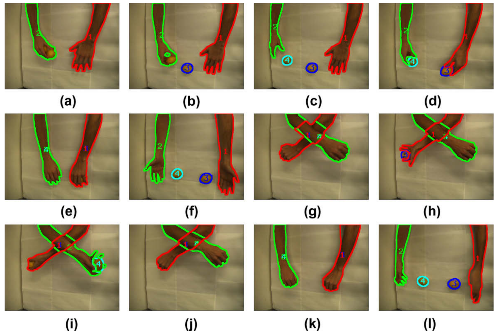

# 이 논문에서 알고 싶은 내용
1. segmentation 은 어떻게 수행한 것인지?
2. occlusion에 대해서 어떻게 장시간 tracking 수행할 수 있는 것인지?

# 1. Introduction
- 기존 방식의 문제점 : 부분적으로 가려진 상황에 대해서는 처리하지만, 완전히 가려진 상황에 대해서는 처리하지 못하고 있다.

## 1) Overview
- a) 백그라운드에 대해서 분리를 한다
- b) Gaussian Mixture Model을 기반으로, 표현한다

## 2) 특징
- a) 추적객체에 대해서 사전적인 트레이닝이 필요하지 않는다.

## 3) section 구성
- a) adopted object representation model
- b) tracker & occlusion reasoning

# 2. Method
## 1) Object modeling
- 개별 객체에 대해서, GMM 기반으로 색상 값의 분포를 타원 형태로 표시함

## 2) foreground blob를 객체와 결합함
- 가정 : 객체끼리 연결되어서, 하나의 blob을 이룰 수 있다는 가정을 사전적으로 함
- 
## 3) object model update

## 4) object visibility & occlusion hanlding

## 5) layered occlusion

## 6) linear prediction & object model propagation
 
# 3. Experiment

# 4. 결론

